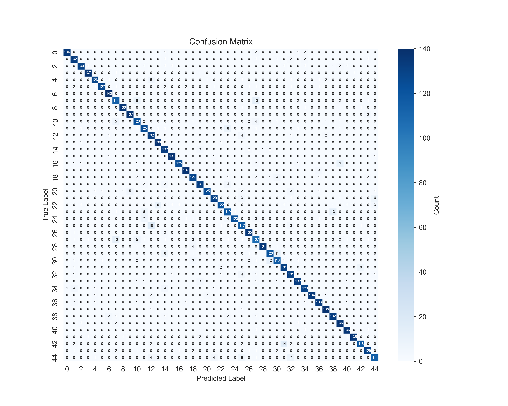
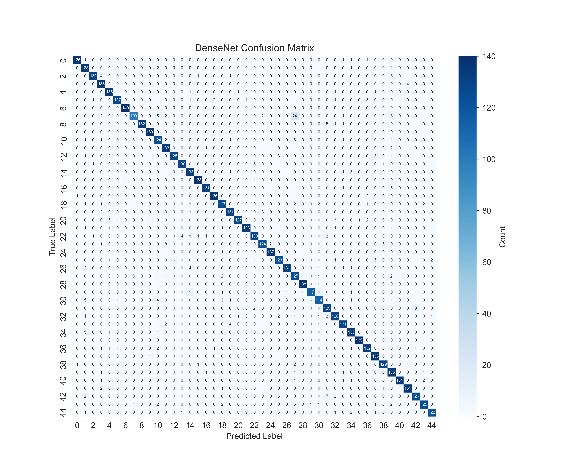
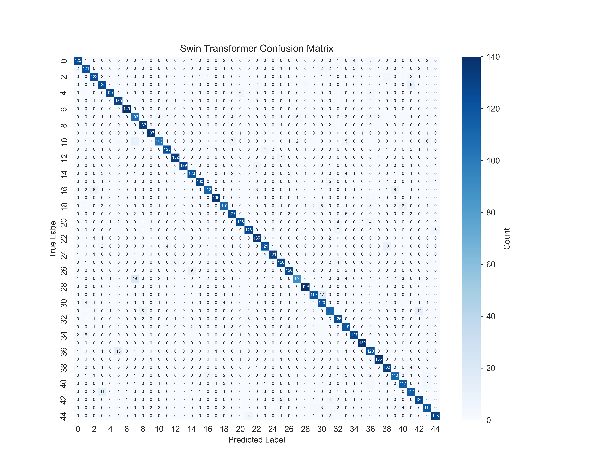

# Intelligent-RS

&nbsp;&nbsp;&nbsp;


This is the model repository of YNU's deep learning principles and platform course assignments, which mainly use remote sensing image datasets to achieve **classification**, **colorization** and **super-resolution**.

The **NWPU-RESISC45** dataset, which is publicly available from the Northwestern Polytechnical University, is the main dataset used in this project. In this dataset, there are a total of 45 categories of remote sensing images, and each category contains 700 remote sensing images, all of which are 256x256 in size.

At the same time, the project is divided by network architecture, and the separate network architecture folder is also a relatively complete code for that network, which can be taken down and run directly.

## Requirements
```bash
pip install torch==1.12.0
pip install torchvision==0.13.0
pip install pillow==9.4.0
pip install matplotlib==3.5.1
pip install seaborn==0.13.2
pip install scikit-learn==1.2.1
pip install scikit-image==0.24.0
```

## Get Started
```bash
git clone https://github.com/JackieLin2004/Intelligent-RS.git
cd Intelligent-RS/
```

## 1. Image Classification

This repository utilizes five classical convolutional neural networks for image classification and also experiments with the Transformer architecture for image classification.

Convolutional Neural Networks include network architectures such as **AlexNet**, **VGGNet**, **GoogLeNet**, **ResNeXt**, and **DenseNet**, while Transformer architectures include **Swin Transformer**.

### 1.1 Preparing the Dataset
Using AlexNet as an example, if you want to use these networks for classification model training, you first need to place the appropriate dataset:
```bash
/dataset/NWPU-RESISC45/
```

### 1.2 Run the Training Script
```bash
/AlexNet/train.py
```

### 1.3 Classification Projections
```bash
/AlexNet/predict.py
```

### 1.4 Charting Indicators
```bash
/AlexNet/draw_indicators.ipynb
```

### 1.5 Indicator Charts for Various Models
<figure style="display: flex; align-items: center; justify-content: center;">
    
    
</figure>

<figure style="display: flex; align-items: center; justify-content: center;">
    
    
</figure>

<figure style="display: flex; align-items: center; justify-content: center;">
    
    
</figure>

<figure style="display: flex; align-items: center; justify-content: center;">
    
    
</figure>

<figure style="display: flex; align-items: center; justify-content: center;">
    
    
</figure>

<figure style="display: flex; align-items: center; justify-content: center;">
    
    
</figure>

## 2. Image Super-Resolution

In this section, this project uses two network architecture implementations, **SRResNet** and **SRGAN**. The former is a traditional convolutional approach and the latter is a generative adversarial network.

### 2.1 Create Data List

Using SRResNet as an example, first you create the data list:
```bash
/SRResNet/create_data_list.py
```
Then the json file will be obtained:
```bash
/SRResNet/data/test_images.json and train_images.json
```

### 2.2 Run the Training Script
```bash
/SRResNet/train.py
```

### 2.3 Evaluation of Test Sets
```bash
/SRResNet/evaluate.ipynb
```

### 2.4 Prediction of a Single Image
```bash
/SRResNet/test.py
```

### 2.5 Comparison of Data on Indicators

<div style="display: flex; justify-content: center; align-items: center; width: 60%; margin: 0 auto;">
    <table style="border-collapse: collapse; text-align: center; width: 100%">
        <tr>
            <th style="border: 1px solid #ddd; padding: 1.5vw; width: 25vw;"></th>
            <th style="border: 1px solid #ddd; padding: 1.5vw; width: 25vw;">SRResNet</th>
            <th style="border: 1px solid #ddd; padding: 1.5vw; width: 25vw;">SRGAN</th>
        </tr>
        <tr>
            <td style="border: 1px solid #ddd; padding: 1.5vw; width: 25vw;">PSNR</td>
            <td style="border: 1px solid #ddd; padding: 1.5vw; width: 25vw;">34.524</td>
            <td style="border: 1px solid #ddd; padding: 1.5vw; width: 25vw;">30.628</td>
        </tr>
        <tr>
            <td style="border: 1px solid #ddd; padding: 1.5vw; width: 25vw;">SSIM</td>
            <td style="border: 1px solid #ddd; padding: 1.5vw; width: 25vw;">0.935</td>
            <td style="border: 1px solid #ddd; padding: 1.5vw; width: 25vw;">0.891</td>
        </tr>
        <tr>
            <td style="border: 1px solid #ddd; padding: 1.5vw; width: 25vw;">Time</td>
            <td style="border: 1px solid #ddd; padding: 1.5vw; width: 25vw;">0.008</td>
            <td style="border: 1px solid #ddd; padding: 1.5vw; width: 25vw;">0.008</td>
        </tr>
    </table>
</div>

## To be continue...
