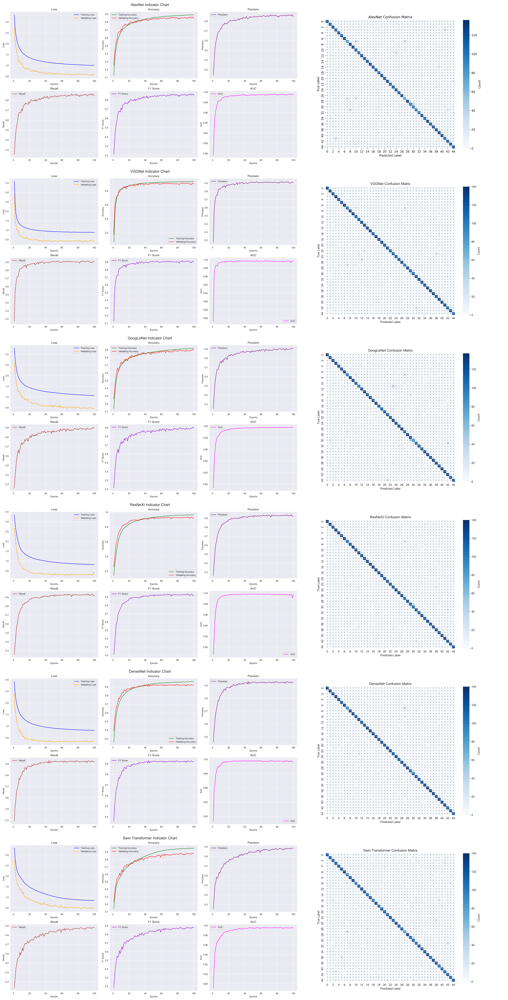
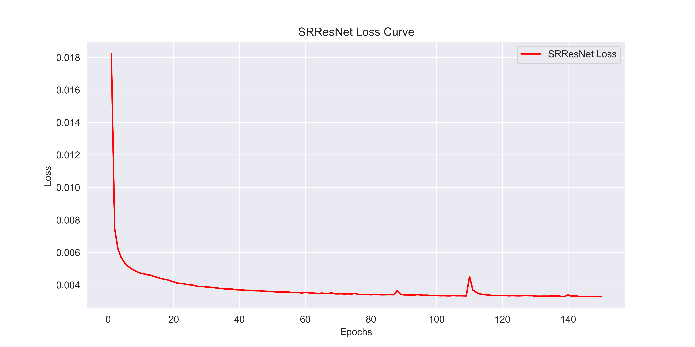
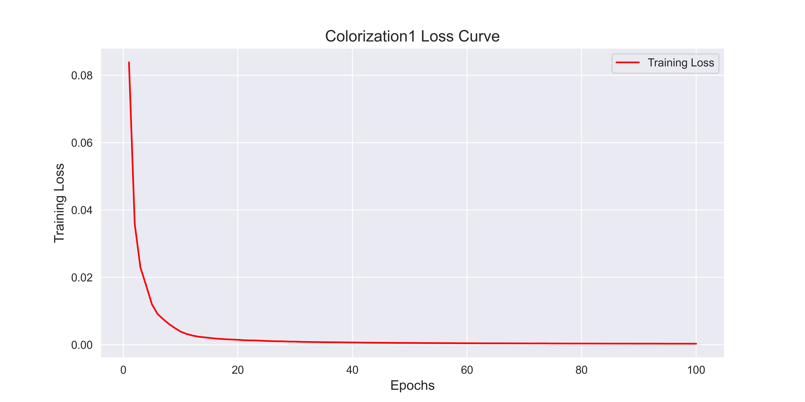
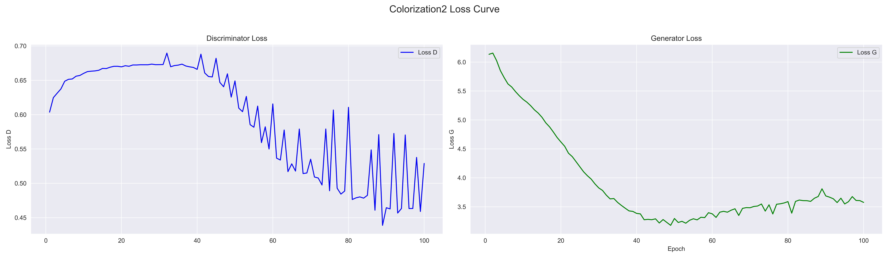

<div align="center">
    
    <h1 style="margin-top: -3vw;">Intelligent-RS</h1>
    &nbsp;&nbsp;&nbsp;
    
</div>

<br>

This is the model repository of YNU's deep learning principles and platform course assignments, which mainly use remote
sensing image datasets to achieve **classification**, **colorization** and **super-resolution**.

The **NWPU-RESISC45** dataset, which is publicly available from the Northwestern Polytechnical University, is the main
dataset used in this project. In this dataset, there are a total of 45 categories of remote sensing images, and each
category contains 700 remote sensing images, all of which are 256x256 in size.

At the same time, the project is divided by network architecture, and the separate network architecture folder is also a
relatively complete code for that network, which can be taken down and run directly.

## Get Started

```bash
git clone https://github.com/JackieLin2004/Intelligent-RS.git
cd ./Intelligent-RS/
```

## Requirements

```bash
pip install torch==1.12.0
pip install torchvision==0.13.0
pip install pillow==9.4.0
pip install matplotlib==3.5.1
pip install seaborn==0.13.2
pip install scikit-learn==1.2.1
pip install scikit-image==0.24.0
```

## Environments

You can install the environment by the following method:

```bash
pip install -r requirements.txt
```

Or you can execute it if you want the full conda environment:

```bash
conda env create -f environment.yaml
```

## 0. Preparation

First, you need to put the **NWPU-RESISC45** dataset into the folder in the following format:

```bash
/dataset/NWPU-RESISC45/subfolder
```

Though it is not necessary for the categorization task and the super-resolution reconstruction task.

But it's needed for colorization tasks, and it is recommended to run the code under the following folder first:

```bash
/data_prepare/
```

## 1. Image Classification

This repository utilizes five classical convolutional neural networks for image classification and also experiments with
the Transformer architecture for image classification.

Convolutional Neural Networks include network architectures such as **AlexNet**, **VGGNet**, **GoogLeNet**, **ResNeXt**,
and **DenseNet**, while Transformer architectures include **Swin Transformer**.

### 1.1 Preparing the Dataset

Using AlexNet as an example, if you want to use these networks for classification model training, you first need to
place the appropriate dataset:

```bash
/dataset/NWPU-RESISC45/
```

### 1.2 Run the Training Script

```bash
/AlexNet/train.py
```

### 1.3 Classification Projections

```bash
/AlexNet/predict.py
```

### 1.4 Charting Indicators

```bash
/AlexNet/draw_indicators.ipynb
```

### 1.5 Indicator Charts for Various Models

<figure style="display: flex; align-items: center; justify-content: center;">
    
</figure>

### 1.6 Classification Model Comparison

<table>
    <tr>
        <th style="text-align: center;">Networks & Metrics</th>
        <th style="text-align: center;">AlexNet</th>
        <th style="text-align: center;">VGGNet</th>
        <th style="text-align: center;">GoogLeNet</th>
        <th style="text-align: center;">ResNeXt</th>
        <th style="text-align: center;">DenseNet</th>
        <th style="text-align: center;">Swin Transformer</th>
    </tr>
    <tr>
        <td style="text-align: center;">Accuracy</td>
        <td style="text-align: center;">0.864</td>
        <td style="text-align: center;">0.920</td>
        <td style="text-align: center;">0.905</td>
        <td style="text-align: center;">0.938</td>
        <td style="text-align: center;">0.929</td>
        <td style="text-align: center;">0.884</td>
    </tr>
    <tr>
        <td style="text-align: center;">Loss</td>
        <td style="text-align: center;">0.545</td>
        <td style="text-align: center;">0.367</td>
        <td style="text-align: center;">0.417</td>
        <td style="text-align: center;">0.374</td>
        <td style="text-align: center;">0.316</td>
        <td style="text-align: center;">0.456</td>
    </tr>
    <tr>
        <td style="text-align: center;">Precision</td>
        <td style="text-align: center;">0.867</td>
        <td style="text-align: center;">0.922</td>
        <td style="text-align: center;">0.910</td>
        <td style="text-align: center;">0.939</td>
        <td style="text-align: center;">0.931</td>
        <td style="text-align: center;">0.886</td>
    </tr>
    <tr>
        <td style="text-align: center;">Recall</td>
        <td style="text-align: center;">0.864</td>
        <td style="text-align: center;">0.920</td>
        <td style="text-align: center;">0.905</td>
        <td style="text-align: center;">0.938</td>
        <td style="text-align: center;">0.929</td>
        <td style="text-align: center;">0.884</td>
    </tr>
    <tr>
        <td style="text-align: center;">F1 Score</td>
        <td style="text-align: center;">0.864</td>
        <td style="text-align: center;">0.920</td>
        <td style="text-align: center;">0.905</td>
        <td style="text-align: center;">0.938</td>
        <td style="text-align: center;">0.929</td>
        <td style="text-align: center;">0.884</td>
    </tr>
    <tr>
        <td style="text-align: center;">AUC</td>
        <td style="text-align: center;">0.997</td>
        <td style="text-align: center;">0.998</td>
        <td style="text-align: center;">0.998</td>
        <td style="text-align: center;">0.999</td>
        <td style="text-align: center;">0.998</td>
        <td style="text-align: center;">0.997</td>
    </tr>
</table>

<figure style="display: flex; align-items: center; justify-content: center;">
    
</figure>

## 2. Image Super-Resolution

In this section, two network architecture implementations are used in this project. The former is a traditional
convolutional approach and the latter is a generative adversarial network.

For convolutional methods, we used SRResNet.

And for generative adversarial networks, we used SRGAN, ESRGAN. in addition, we made a little improvement to SRGAN,
which is tentatively called ISRGAN here.

### 2.1 Create Data List

Using SRResNet as an example, first you create the data list:

```bash
/SRResNet/create_data_list.py
```

Then the json file will be obtained:

```bash
/SRResNet/data/test_images.json and train_images.json
```

### 2.2 Run the Training Script

```bash
/SRResNet/train.py
```

### 2.3 Evaluation of Test Sets

```bash
/SRResNet/evaluate.ipynb
```

### 2.4 Prediction of a Single Image

```bash
/SRResNet/test.py
```

### 2.5 Comparison of Data on Indicators

<table>
    <tr>
        <th style="text-align: center;"></th>
        <th style="text-align: center;">SRResNet</th>
        <th style="text-align: center;">SRGAN</th>
        <th style="text-align: center;">ISRGAN</th>
    </tr>
    <tr>
        <td style="text-align: center;">PSNR</td>
        <td style="text-align: center;">34.524</td>
        <td style="text-align: center;">30.628</td>
        <td style="text-align: center;">30.169</td>
    </tr>
    <tr>
        <td style="text-align: center;">SSIM</td>
        <td style="text-align: center;">0.935</td>
        <td style="text-align: center;">0.891</td>
        <td style="text-align: center;">0.863</td>
    </tr>
    <tr>
        <td style="text-align: center;">Time</td>
        <td style="text-align: center;">0.008</td>
        <td style="text-align: center;">0.008</td>
        <td style="text-align: center;">0.011</td>
    </tr>
</table>

For SRResNet, the loss varies as shown in Fig:
<figure style="display: flex; align-items: center; justify-content: center;">
    
</figure>

For SRGAN, the loss varies as shown in Fig:
<figure style="display: flex; align-items: center; justify-content: center;">
    
</figure>

For ISRGAN, the loss varies as shown in Fig:
<figure style="display: flex; align-items: center; justify-content: center;">
    
</figure>

Obviously, as can be seen from the above graph of the loss curve of GAN, the loss of adversarial neural network is not
stable, especially the generative loss and discriminative loss are doing fierce confrontation between each other. We do
not directly judge the effect by the loss.

### 2.6 Effective Demonstration

<figure style="display: flex; align-items: center; justify-content: center;">
    
</figure>

For ISRGAN, we replaced its original ordinary convolution module with a residual module, which is visually better than
the original one, although there is no improvement in the metrics.

However, as can be seen from the loss plot, the overall trend of ISRGAN is smoother and better.

## 3. Image Colorization

In this section, for the image colorization task, we again proceeded with two ideas. One is CNN architecture to extract
color features and the other is GAN architecture to generate images.

The Colorization1 and Colorization2 folders then correspond to the implementation of the CNN architecture and the GAN
architecture, respectively.

### 3.1 Prepared Work

Using Colorization1 as an example, first you should do some prepared work:

```bash
/Colorization1/prework.ipynb
```

Then the target file will be obtained:

```bash
/dataset/colorization_/
```

In the case of the Colorization2 model there is no need for preprocessing, as this is already done in Preparation.

### 3.2 Run the Training Script

```bash
/Colorization1/train.py
```

### 3.3 Evaluation of Test Sets

```bash
/Colorization1/evaluate.ipynb
```

### 3.4 Prediction of a Single Image

```bash
/Colorization1/test.py
```

### 3.5 Comparison of Data on Indicators

<table>
    <tr>
        <th style="text-align: center;"></th>
        <th style="text-align: center;">Colorization1</th>
        <th style="text-align: center;">Colorization2</th>
    </tr>
    <tr>
        <td style="text-align: center;">PSNR</td>
        <td style="text-align: center;">30.733</td>
        <td style="text-align: center;">30.980</td>
    </tr>
    <tr>
        <td style="text-align: center;">SSIM</td>
        <td style="text-align: center;">0.865</td>
        <td style="text-align: center;">0.977</td>
    </tr>
    <tr>
        <td style="text-align: center;">Time</td>
        <td style="text-align: center;">0.0042</td>
        <td style="text-align: center;">0.0265</td>
    </tr>
</table>

For Colorization1, the loss varies as shown in Fig:

<figure style="display: flex; align-items: center; justify-content: center;">
    
</figure>

For Colorization2, the loss varies as shown in Fig:

<figure style="display: flex; align-items: center; justify-content: center;">
    
</figure>

### 3.6 Effective Demonstration

<figure style="display: flex; align-items: center; justify-content: center;">
    
</figure>

## To be continue...
